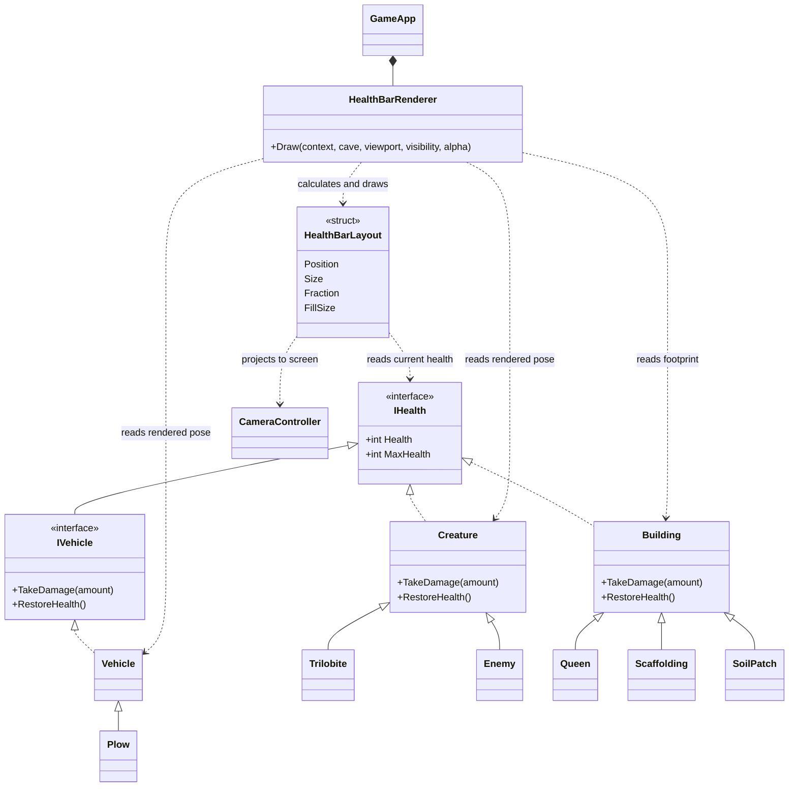

# World health bars

Every living, damaged creature, vehicle, and building gets one horizontal health bar above it.
The outer width is always 75% of one tile, even for a building or vehicle spanning several tiles.
The bar is 1/16 tile tall, with a 1/16 tile gap above the entity; all dimensions follow camera zoom.
Its dark border surrounds a track whose fill represents current health divided by maximum health.
The fill is green above half health, amber at half health or below, and red at quarter health or below.

Full-health entities have no bar. Damage changes the fill on the next rendered frame; restoring
full health removes the bar on that frame. Dead or removed entities have no bar. Visibility follows
the world sprites, including hidden creatures and unrevealed scaffolding. Health bars render after
world lighting and overlays, before Gum panels, so lighting and world sprites cannot obscure them.

- `IHealth` is the common read-only health contract. The entities keep their existing health,
  damage, healing, and removal ownership; the renderer cannot change their health through it.
- `HealthBarRenderer` walks the cave's existing entity collections each frame. It places bars above
  the same interpolated positions, rotations, texture dimensions, and vehicle pivots used by world
  drawing. Buildings use their whole rotated footprint, including soil patches and scaffolding.
- `HealthBarLayout` is a temporary value containing screen position, dimensions, and health fraction.
  It decides whether a bar is needed and scales its dimensions with the camera. No health copy,
  event subscription, retained per-entity UI object, or simulation tick work is added.
- `GameApp` owns the renderer and calls it in the world overlay pass using the existing white-pixel
  texture. There are no new content assets or content build steps.

Vehicles now expose `RestoreHealth()` alongside the existing creature and building methods. This
restores the current value to the maximum; it does not introduce automatic repairs or a healing timer.

`HealthBarRendererTests` cover damage, healing, death, hidden and removed entities, scaffold reveal,
camera scaling and panning, building rotation, sprite pivots, movement interpolation, and viewport culling.
